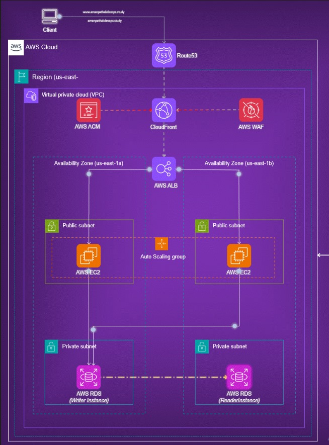
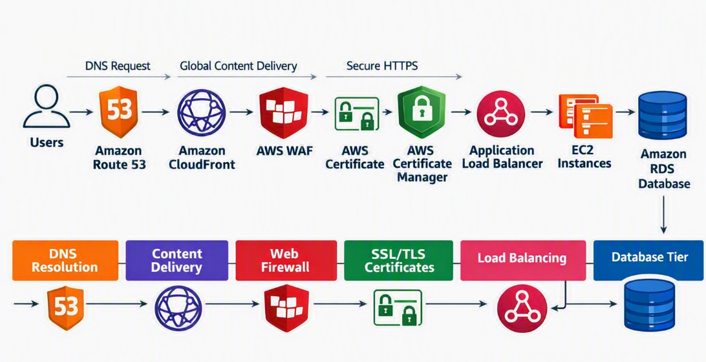

# AWS High-Availability Cloud Architecture

---

### Description:
The Project represents a highly available, secure, and scalable AWS environment tailored for enterprise workloads. At the edge, Amazon Route 53 provides DNS routing, while Amazon CloudFront ensures low-latency global content delivery. Security is reinforced through AWS WAF for application-level protection and AWS Certificate Manager (ACM) for SSL/TLS encryption.

### Architecture:


---

# AWS Services Used
### AWS:
AWS (Amazon Web Services) is the world’s most widely adopted cloud platform, offering over 200 fully featured services ranging from compute and storage to networking, databases, AI/ML, and security. It’s designed to help individuals, startups, and enterprises build scalable, reliable, and cost‑effective solutions.

---

### AWS Regions:
* AWS has Regions all around the world
* A region is a cluster of data centers

---

### AWS Availability Zones:
* Each region has many availability zones (usually 3, min is 3, max is 6).
* Each availability zone (AZ) is one or more discrete data centers with redundant power, 
networking, and connectivity
* They’re separate from each other, so that they’re isolated from disasters.

---

### VPC in AWS:
- **VPC (Virtual Private Cloud)**
  - You can have multiple VPCs in an AWS region  
    - Maximum: 5 per region (soft limit)
    - Maximum CIDR blocks per VPC: 5
  - CIDR block size limits:
    - Minimum: `/28` → 16 IP addresses
    - Maximum: `/16` → 65,536 IP addresses
- **Because VPC is private, only Private IPv4 ranges are allowed:**
  - `10.0.0.0 – 10.255.255.255` (`10.0.0.0/8`)
  - `172.16.0.0 – 172.31.255.255` (`172.16.0.0/12`)
  - `192.168.0.0 – 192.168.255.255` (`192.168.0.0/16`)

--- 

### Subnet: A subnet (short for subnetwork) is a logical subdivision of an IP network.
- **AWS reserves 5 IP addresses in every subnet (first 4 + last 1):**
  - These addresses are not available for use and cannot be assigned to EC2 instances.
  - **Example: CIDR block `10.0.0.0/24`**
    - `10.0.0.0` → Network Address
    - `10.0.0.1` → Reserved by AWS for the VPC router
    - `10.0.0.2` → Reserved by AWS for mapping to Amazon-provided DNS
    - `10.0.0.3` → Reserved by AWS for future use
    - `10.0.0.255` → Network Broadcast Address  
      - AWS does ***not support broadcast*** in a VPC, so this address is ***reserved***


---

## Types of subnets:
### Private subnet: 
A private Subnet does not have direct access to the internet.
A subnet where resources (like EC2 instances) are isolated from the public internet. 

### Public Subnet:
A subnet where resources can be accessed from the internet.
A Public Subnet in AWS is a subnet inside your VPC that is directly connected to the internet through an Internet Gateway.

---

### Internet Gateway (IGW)
- An Internet Gateway allows resources (e.g., EC2 instances) in a **VPC** to connect to the **Internet**.
- It scales **horizontally**, is **highly available**, and **redundant**.
- Must be created **separately** from a VPC.
- **One VPC ↔ One IGW** (a VPC can only be attached to one IGW, and an IGW can only be attached to one VPC).
---

### Key Points
- No **Security Groups** required or managed.
- Ideal for allowing **private EC2 instances** to access the Internet (e.g., software updates, package downloads).
- Ensures outbound connectivity while keeping instances **unreachable from the Internet**.

---

### Security Groups
- Security Groups are the **fundamentals of network security** in AWS.
- They control how traffic is allowed **into or out of EC2 instances**.
- Operate at the **instance level** (not subnet level like NACLs).

---

### Network Access Control List (NACL)

- NACLs act like a **firewall** controlling traffic **to and from subnets**.
- Each subnet is associated with **one NACL**.
- Newly created subnets are assigned the **Default NACL**.
- **Newly created NACLs** → deny all inbound/outbound traffic by default.
- **Default NACL** → allows all inbound/outbound traffic.
- NACLs are useful for **blocking specific IP addresses** at the subnet level.
- Stateless: return traffic must be explicitly allowed.
- Applied at the **subnet level**, not instance level.
- Complementary to **Security Groups** (which operate at the instance level).

---

### EC2: EC2 = Elastic Compute Cloud = Infrastructure as a Service

* Virtual servers in the cloud
* Renting computing power on demand
* We can choose the operating system, CPU, memory, storage, and networking configuration to suit your workload.

---

### Elastic Load Balancer (ELB)

- An **Elastic Load Balancer** is a **managed load balancer** provided by AWS.
- Load balancers are servers that **forward traffic** to multiple downstream servers (e.g., EC2 instances).
- ELB improves **availability, fault tolerance, and scalability** by distributing traffic intelligently.

### Types of Load Balancers

#### 1. Application Load Balancer (ALB)
- Operates at **Layer 7** (Application Layer).
- Protocols: **HTTP, HTTPS, WebSocket**.
- Best for: **Web applications, APIs, microservices**.
- Features: Content-based routing (URL, headers, cookies), supports modern protocols.

#### 2. Network Load Balancer (NLB)
- Operates at **Layer 4** (Transport Layer).
- Protocols: **TCP, TLS (secure TCP), UDP**.
- Best for: **High-performance, low-latency applications**.
- Features: Handles millions of requests per second, supports static IPs.

#### 3. Gateway Load Balancer (GWLB)
- Operates at **Layer 3** (Network Layer).
- Protocol: **IP**.
- Best for: Deploying **security appliances** (firewalls, intrusion detection/prevention).
- Features: Transparent traffic inspection, integrates with third-party appliances.

---

## Target Groups

- A **Target Group** is a logical grouping of targets:
  - **EC2 instances**
  - **IP addresses**
  - **Lambda functions**
- Load balancers (ALB, NLB, GWLB) forward traffic to one or more target groups.

### Health Checks
- Each target group has its own **health check configuration**.
- Only healthy targets receive traffic.
- Health checks can be customized (path, interval, timeout, success codes).

### Routing with ALB
- Application Load Balancers (ALB) support **rule-based routing**:
  - **Path-based routing** → e.g., `/app/*` → App target group.
  - **Host-based routing** → e.g., `api.example.com` → API target group.
- Enables **microservices architecture** and **service isolation**.

---

### Amazon RDS:
### Amazon RDS (Relational Database Service)
- RDS is a managed database service by AWS.
- It supports SQL as a query language.
- It allows you to create and manage cloud databases without manual administration.

### Supported Database Engines
- PostgreSQL
- MySQL
- MariaDB
- Oracle
- Microsoft SQL Server
- IBM DB2
- Aurora (AWS proprietary database)

---

### Amazon RDS Multi-AZ Deployment
- **Synchronous replication** between primary and standby
- **Single DNS name** – automatic application failover to standby
- **High availability** – minimizes downtime
- **Automatic failover** in case of:
  - Loss of Availability Zone (AZ)
  - Network failure
  - Instance failure
  - Storage failure
- **No manual intervention** required in applications

---

### AWS Certificate Manager (ACM)

#### Overview
AWS Certificate Manager (ACM) is a managed service that provides free SSL/TLS certificates to secure your applications with HTTPS. It automates certificate provisioning, renewal, and deployment, reducing manual effort.

#### Key Points
- Issues public certificates for domains like `prathap.shop`.
- Supports DNS validation for quick, automated approval.
- Integrates seamlessly with CloudFront, ALB, and API Gateway.
- Ensures encrypted, secure communication between users and your application.

---

### Amazon CloudFront

##### Overview
Amazon CloudFront is a fast, secure Content Delivery Network (CDN) service that delivers data, videos, applications, and APIs to users globally with low latency and high transfer speeds.

#### Key Points
- **Global Edge Network:** Distributes content through worldwide edge locations for faster access.  
- **Security:** Integrates with AWS WAF and ACM to provide DDoS protection and HTTPS encryption.  
- **Scalability:** Automatically handles traffic spikes without manual intervention.  
- **Integration:** Works seamlessly with Route 53, ALB, and S3 to deliver applications securely.  

#### Usage in Project
In this architecture:
- CloudFront acts as the **public entry point** for `prathap.shop`.  
- It forwards requests to the **Application Load Balancer (ALB)**.  
- Configured to **redirect HTTP to HTTPS** using the ACM certificate.  
- Provides caching and security before traffic reaches EC2 and RDS.

---

### AWS WAF (Web Application Firewall)

#### Overview
AWS WAF is a managed firewall that protects web applications from common threats like SQL injection, cross‑site scripting (XSS), and malicious bots.

#### Key Points
- Blocks harmful requests before they reach CloudFront or ALB.  
- Provides **AWS Managed Rules** for quick, reliable protection.  
- Supports custom rules (IP, geo, patterns).  
- Integrates with CloudFront for global coverage.  

#### Usage in Project
For `prathap.shop`, WAF is attached to the **CloudFront distribution**, ensuring only secure traffic reaches the ALB, EC2, and RDS layers.

---

### Amazon Route 53

#### Overview
Amazon Route 53 is a scalable DNS service that routes user requests to applications hosted on AWS.

#### Key Points
- Manages domains like `prathap.shop`.  
- Translates domain names into IP addresses.  
- Supports routing policies and health checks.  
- Integrates seamlessly with CloudFront and ALB.  

#### Usage in Project
For `prathap.shop`, Route 53 hosts the domain and points it to the **CloudFront distribution**, ensuring all traffic flows securely into the architecture.

---

#### Application Request Lifecycle (End‑to‑End Request Flow)

#### Web Tier
- **AWS Two EC2** instances
- Deployed in **Public Subnets**
- Load Distributed across **two Availability Zones**
- Receives user requests through an **Application Load Balancer** (ELB)

#### Database Tier
- **Amazon RDS** deployed in **private database subnets**  
- **Isolated from direct internet access** for enhanced security  
- **Accessible only from the Application Tier** within the VPC  
- **Primary Writer instance** handles all database write operations  
- **Read Replica** supports read workloads, improving performance and scalability

#### Application Traffic Flow and Security Layer
- **Amazon Route 53** handles DNS resolution for the application domain  
- **Amazon CloudFront** serves as the global entry point for application traffic  
- **AWS WAF** protects against common web application exploits  
- **AWS Certificate Manager (ACM)** provides SSL/TLS certificates for secure HTTPS communication  
- **Application Load Balancer (ALB)** distributes incoming traffic across EC2 instances

#### Networking & Subnet Layer
- **Dedicated AWS Virtual Private Cloud (VPC)** in the **North Virginia (us-east-1) region**  
- Spans **two Availability Zones**:  
  - `us-east-1a`  
  - `us-east-1b`  
- **Public Subnets** host the application EC2 instances in the current design  
- **Private Subnets** host the Amazon RDS database  
- **Security Groups** enforce controlled communication between the ALB, EC2, and RDS layers

#### Traffic flow


---

## Process steps:

### Step-1: Create VPC and Subnets by using option called VPC and more
Dedicated VPC with public subnets for EC2 and private subnets for RDS, plus Internet gateways and route tables configured automatically.


---

### Step-2: AWS Security Group Rules

| RESOURCES  | Protocol   | Port Range     | Source        | Description                          |
|------------|------------|----------------|---------------|--------------------------------------|
| ALB-SG     | HTTP/HTTPS | 80, 443        | 0.0.0.0/0     | Public entry point for web traffic   |
| WEB-EC2-SG | TCP        | 22, 80, 443    | ALB-SG, Admin | Allow traffic from ALB + SSH admin   |
| RDS-SG     | TCP        | 3306           | WEB-EC2-SG    | Allow DB access only from Web EC2    |


---

### Step-3: Launch Web Tier EC2 Instances
Launch two EC2 instances:

```text
Web EC2 1 → Public Subnet 1
Web EC2 2 → Public Subnet 2
```


---

### Step-4: SSH Into EC2 Instances 
***Web tier*** 
#### Repeat for both Instances ***(13.221.199.23 & 3.239.246.248)***
```bash
ssh -i "C:\VCUBE DOCUMENTS\Defaultkeypair.pem" ubuntu@13.221.199.23 
sudo -i
apt update -y
apt install apache2 -y
cd var/www/html
rm index.html
vim customer.php (PHP Script)
sudo systemctl status apache2
sudo systemctl start apache2
sudo nano /var/www/html/customers.php
sudo apt install apache2 php libapache2-mod-php php-mysql -y
sudo chown www-data:www-data /var/www/html/customer.php
sudo chmod 644 /var/www/html/customer.php
http://<EC2-Public-IP>/customer.php
```

---

### Step-5: Create Target Groups for Web tier EC2 Instances
#### Target Group Configuration
5.1. **Create Target Groups**
   - Navigate to **EC2 → Target Groups → Create Target Group**.
   - Select **Instances** as the target type.
   - Choose **HTTP** protocol and port (e.g., 80 or 8080 depending on your app).
   - Name your target group (e.g., `Web-TG`).

5.2. **Register EC2 Instances**
   - Select the required **EC2 instances** in your VPC.
   - Register them under the target group.
   - Ensure they are deployed across **multiple Availability Zones** for high availability.

5.3. **Configure Health Checks**
   - Set **Health check protocol** = HTTP.
   - Define **Health check path** = `/` (or your app’s endpoint).
   - Adjust thresholds:
     - Healthy threshold = 2  
     - Unhealthy threshold = 2  
     - Timeout = 5 seconds  
     - Interval = 30 seconds  

#### Example
- **Target Group Name:** `Web-TG`
- **Protocol/Port:** HTTP : 80
- **Health Check Path:** `/`
- **Registered Targets:** EC2 instances in `us-east-1a` and `us-east-1b`

---

### Step-6: Create Application Load Balancer
#### Configuration
- **Scheme:** Internet-facing  
- **IP Address Type:** IPv4  
- **Subnets:**  
  - Public Subnet 1  
  - Public Subnet 2  
- **Security Group:** ALB Security Group  

#### Listener Setup
- **Protocol:** HTTP  
- **Port:** 80  
- **Action:** Forward requests to the target group (e.g., `Web-TG`)

---

### Step-7: Create SSL/TLS Certificate using AWS Certificate Manager (ACM)

ACM is used to create an SSL/TLS certificate for the **prathap.shop** domain so that the application can be accessed securely over HTTPS.

#### Request a Certificate

7.1. **Open ACM Console**
   - Navigate to **AWS Console → Certificate Manager (ACM)**

7.2. **Request a Public Certificate**
   - Choose **Request a public certificate**
   - Enter your domain name: `prathap.shop`
   - (Optional) Add additional names like `www.prathap.shop`

7.3. **Validation Method**
   - Select **DNS Validation** (recommended)
   - ACM provides a CNAME record to add in Route 53 (or your DNS provider)

7.4. **Submit Request**
   - Click **Request**
   - Certificate status will show: **Pending validation**

7.5. **Complete Validation**
   - Add the provided CNAME record in your DNS
   - Once validated, status changes to **Issued**
#### Screenshot: ACM certificate issued


---

### Step-8: Create Route 53 Hosted Zone

#### Configuration

8.1. **Open Route 53 Console**
   - Navigate to **AWS Console → Route 53 → Hosted Zones**

8.2. **Create Hosted Zone**
   - Enter your domain name: `prathap.shop`
   - Select **Public Hosted Zone** (for internet-facing applications)

8.3. **Name Server (NS) Records**
   - Route 53 will automatically generate **NS records** for your hosted zone.
   - Example:
     ```
     ns-727.awsdns-26.net
     ns-322.awsdns-40.com
     ns-1978.awsdns-55.co.uk
     ns-1482.awsdns-57.org
     ```

8.4. **Update Domain Registrar**
   - Go to your domain registrar (where you purchased `prathap.shop`).
   - Replace the existing name servers with the **Route 53 NS records**.
   - Save changes.

8.5. **Propagation**
   - DNS propagation may take up to **24 hours** globally.
   - Use tools like `nslookup prathap.shop` or [dnschecker.org](https://dnschecker.org) to verify.

---

### Step-9: Create CloudFront Distribution

CloudFront is used as the public entry point for the application (prathap.shop). It receives requests from users and forwards them to the Application Load Balancer (ALB).

#### Create CloudFront Distribution
- AWS Console → CloudFront → Distributions → Create Distribution

#### Distribution Settings
- **Distribution Name:** prathap-CloudFront  
- **Distribution Type:** Web  
- **Domain Name:** prathap.shop  
- Click **Next**

#### Configure the Origin
- **Origin Type:** Application Load Balancer  
- **Origin Domain:** Select your ALB DNS name  
- **Origin Protocol:** HTTP only  

#### Configure Cache Settings
- **Customize cache settings**  
- **Redirect HTTP to HTTPS**

This ensures that users accessing the application over HTTP are automatically redirected to HTTPS.

#### Configure Alias record in DNS Route53 Records
```bash
For prathap.shop
Record type                A – IPv4 address
Record name                prathap.shop
Route traffic to           Alias to CloudFront distribution
CloudFront distribution    Select your prathap.shop CloudFront distribution
Click on create record

For www.prathap.shop
Record type                A – IPv4 address
Record name                www.prathap.shop
Route traffic to           Alias to CloudFront distribution
CloudFront distribution    Select your www.prathap.shop CloudFront distribution
Click on create record          

```

#### Example Flow
```text
http://prathap.shop/customer.php
          |
          v
   Redirect to HTTPS
          |
          v
https://prathap.shop/customer.php

```

---

### Step-10: Integrate AWS WAF (Web Application Firewall)

AWS WAF protects the application from common web exploits (SQL injection, XSS, bots, etc.) by filtering traffic before it reaches CloudFront or ALB.

#### Configuration Steps

9.1. **Open WAF Console**
   - AWS Console → WAF & Shield → Web ACLs → Create Web ACL

9.2. **Create Web ACL**
   - Name: `prathap-WAF`
   - Scope: Choose **CloudFront** (recommended for global protection)
   - Region: Global (for CloudFront)

9.3. **Add Rules**
   - Select **AWS Managed Rule Groups** (quick protection):
     - `AWSManagedRulesCommonRuleSet` (SQLi, XSS, bad inputs)
     - `AWSManagedRulesKnownBadInputsRuleSet`
     - `AWSManagedRulesBotControlRuleSet` (optional)
   - You can also create **custom rules** (e.g., block specific IPs or geographies).

9.4. **Associate Web ACL**
   - Attach the Web ACL to your **CloudFront Distribution** (`prathap-CloudFront`)
   - (Optional) You can also attach to ALB if needed.

#### Flow Diagram

   User Request
         |
         v
   CloudFront + WAF (filters malicious traffic)
         |
         v
Application Load Balancer (ALB)
         |
         v
EC2 Instances → RDS

---

### Step-11: Final Output
Once the Route 53 record is created, the domain `prathap.shop` will correctly resolve to the CloudFront distribution.

#### Screenshot: Final output


---
