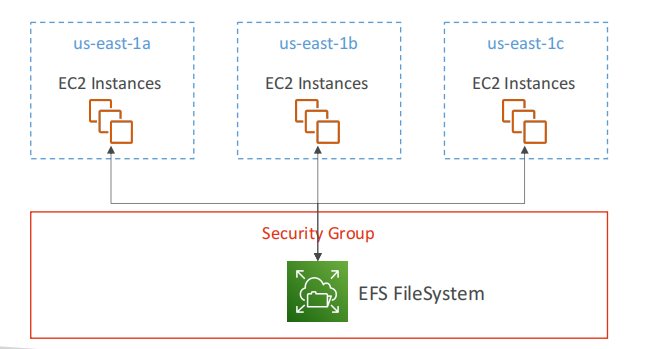
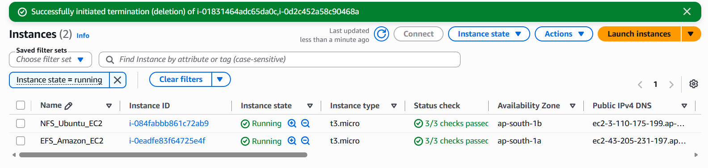
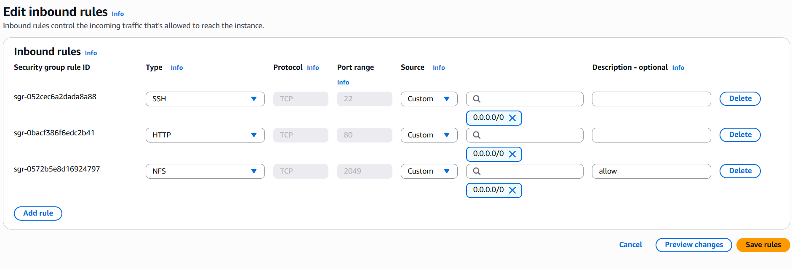
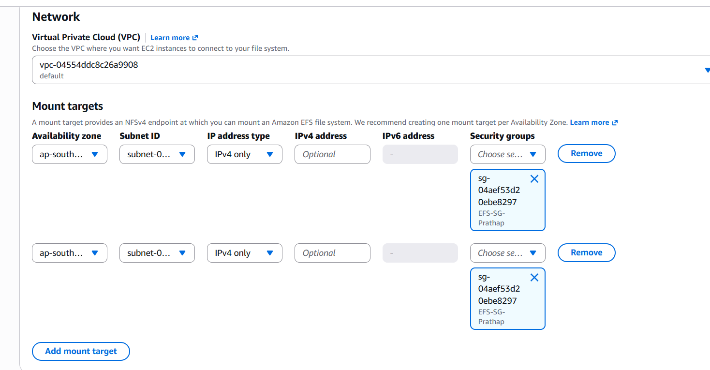
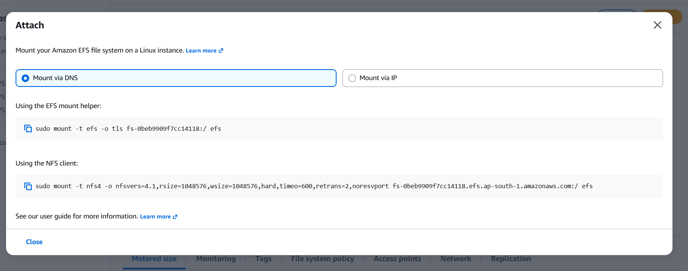
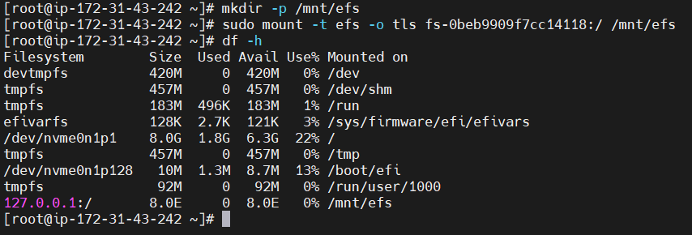
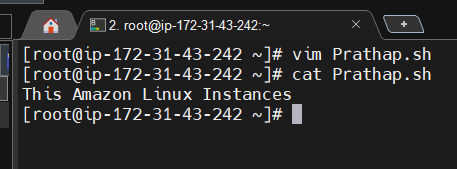

# EFS file Transfer between existing both Ubuntu and Amazon Ec-2

## Objective: To establish a secure, scalable, and high‑availability shared storage solution using Amazon Elastic File System (EFS) for seamless file transfer and synchronization between two existing EC2 instances within the same VPC, ensuring data consistency, minimal latency, and simplified management of shared resources.

---

## What is EFS?
***Amazon EFS – Elastic File System***
* Managed NFS (network file system) that can be mounted on many EC2
* EFS works with EC2 instances in **multi-AZ**
* Highly available, scalable, expensive (3x gp2), pay per use

---

# Architecture:

---

# Prerequisites:
* Two EC2 instances (Ubuntu and Amazon Linux)
* Security groups configured
* EFS file system
* SSH access to both instances

---

# step 1: Launch Ec2 instance
Create the following Two EC2 Instances
* Ubuntu
* Amazon

---

# Step 2: Security Group:
In SG the add following inbound rules

| Type | Protocol | Port | Source         |
| ---- | -------- | ---- | -------------- |
| SSH  | TCP      | 2049 | 0.0.0.0/0      |
| HTTP | TCP      | 80   | 0.0.0.0/0      |  
| NFS  | TCP      | 2049 | 0.0.0.0/0      |

***Security Groups***

---

# Step 3: Create an EFS File system 

1. Sign in to the AWS Management Console.
2. Search for **Amazon EFS**.
3. Open **Elastic File System**.
4. Click **Create file system**.
5. Select **Customize**.

# Step 4: Configure Network Settings:
* Select the VPC where Ec2 instances are launched
* Select the Mounting targets with AZ and along with created EFS Security groups
  
Configure Network Settings

# Step 5: Run the following Commands in Amazon Linux Instances

* ssh -i "C:\VCUBE DOCUMENTS\Customkeypair.pem" ec2-user@ec2-43-205-231-197.ap-south-1.compute.amazonaws.com
* Sudo -i
* yum update -y && yum install -y amazon-efs-utils
* mkdir -p /mnt/efs
* sudo mount -t efs -o tls fs-0beb9909f7cc14118:/ /mnt/efs

# Mount your Amazon EFS file system on a Linux instance (Attach)

 

# To verify the EFS is attachment:
Run Command: ***df -h***
Verify the attachment:

# Create file in Amazon Linux Ec2

## Run commands 

* Vim Prathap.sh
* cat Prathap.sh

## Output: Amazon Linux Instances 

  
  

