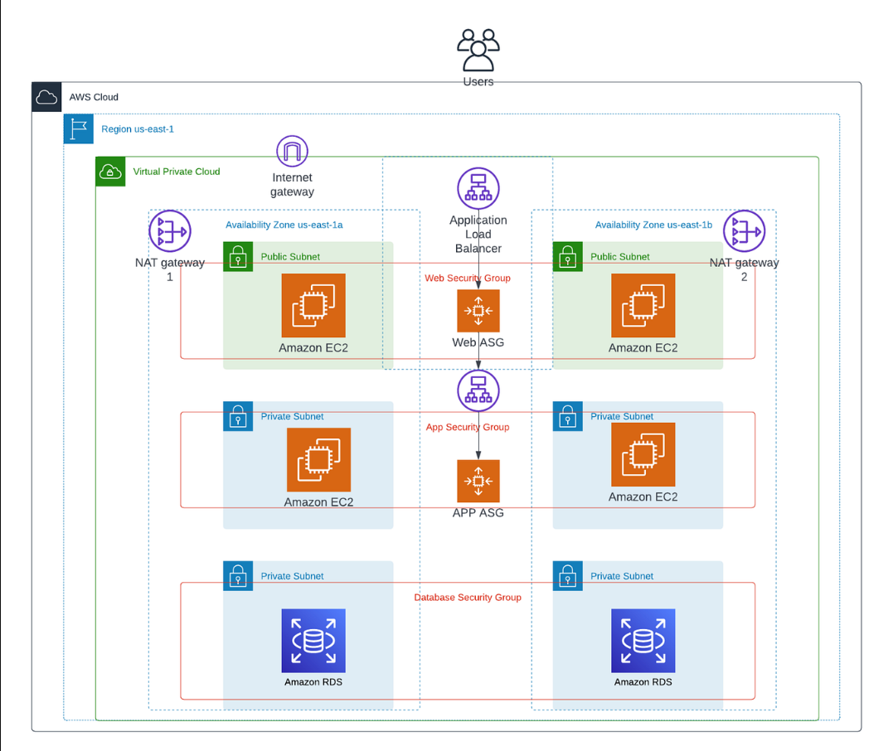

# AWS Multi‑Tier Scalable Architecture

---

## Project Description:
This project demonstrates the deployment of a highly available, secure, and scalable three‑tier web application architecture on AWS. 
It integrates load balancing, auto scaling, and multi‑AZ database redundancy to ensure resilience, while leveraging VPC networking and
security groups for controlled access across tiers.

---

## Architecture:

---

## Prerequisites:

* ✅ VPC
* ✅ Subnets
* ✅ Security groups configured
* ✅ NACL Default
* ✅ Four EC2 instances
* ✅ Auto scaling Groups
* ✅ Load Balancers-ALB
* ✅ AMI
* ✅ Launch Template
* ✅ NAT Gateway
* ✅ Internet Gateway
* ✅ RDS multi-Az
* ✅ SSH access to both instances
* ✅ Customer date to be inserted

---

### AWS:
AWS (Amazon Web Services) is the world’s most widely adopted cloud platform, offering over 200 fully featured services ranging from compute and storage to networking, databases, AI/ML, and security. It’s designed to help individuals, startups, and enterprises build scalable, reliable, and cost‑effective solutions.

---

### AWS Regions:
* AWS has Regions all around the world
* A region is a cluster of data centers

---

### AWS Availability Zones:
* Each region has many availability zones (usually 3, min is 3, max is 6).
* Each availability zone (AZ) is one or more discrete data centers with redundant power, 
networking, and connectivity
* They’re separate from each other, so that they’re isolated from disasters.

---

### VPC in AWS:
- **VPC (Virtual Private Cloud)**
  - You can have multiple VPCs in an AWS region  
    - Maximum: 5 per region (soft limit)
    - Maximum CIDR blocks per VPC: 5
  - CIDR block size limits:
    - Minimum: `/28` → 16 IP addresses
    - Maximum: `/16` → 65,536 IP addresses
- **Because VPC is private, only Private IPv4 ranges are allowed:**
  - `10.0.0.0 – 10.255.255.255` (`10.0.0.0/8`)
  - `172.16.0.0 – 172.31.255.255` (`172.16.0.0/12`)
  - `192.168.0.0 – 192.168.255.255` (`192.168.0.0/16`)

--- 

### Subnet: A subnet (short for subnetwork) is a logical subdivision of an IP network.
AWS reserves 5 IP addresses (first 4 & last 1) in each subnet
These 5 IP addresses are not available for use and can’t be assigned to an 
EC2 instance
-***Example: if CIDR block 10.0.0.0/24, then reserved IP addresses are:***
 -10.0.0.0 – Network Address
 -10.0.0.1 – reserved by AWS for the VPC router
 -10.0.0.2 – reserved by AWS for mapping to Amazon-provided DNS
 -10.0.0.3 – reserved by AWS for future use
 -10.0.0.255 – Network Broadcast Address. AWS does not support broadcast in a VPC, therefore the address is reserved

---

## Types of subnets:
### Private subnet: 
A private Subnet does not have direct access to the internet.
A subnet where resources (like EC2 instances) are isolated from the public internet. 

### Public Subnet:
A subnet where resources can be accessed from the internet.
A Public Subnet in AWS is a subnet inside your VPC that is directly connected to the internet through an Internet Gateway.

---

### Internet Gateway (IGW):

Allows resources (e.g., EC2 instances) in a VPC connect to the Internet
• It scales horizontally and is highly available and redundant
• Must be created separately from a VPC
• One VPC can only be attached to one IGW and vice versa

Internet Gateways on their own do not allow Internet access…
• Route tables must also be edited!

---

### NAT Gateway:
• AWS-managed NAT, higher bandwidth, high availability, no administration
• Pay per hour for usage and bandwidth
• NATGW is created in a specific Availability Zone, uses an Elastic IP
• Can’t be used by EC2 instance in the same subnet (only from other 
subnets)
• Requires an IGW (Private Subnet => NATGW => IGW)
• 5 Gbps of bandwidth with automatic scaling up to 100 Gbps
• No Security Groups to manage / required

---

### Security Group:
* Security Groups are the fundamental of network security in AWS
*They control how traffic is allowed into or out of our EC2 Instances. 
Security groups only contain allow rules
* Security groups rules can reference by IP or by security group.
*Operates at the instance level
*Supports allow rules only
*Stateful: return traffic is automatically allowed, regardless of any rules
*All rules are evaluated before deciding whether to allow traffic
*Applies to an EC2 instance when specified by someone.

---

### NACL: Network Access Control List
*NACL are like a firewall which control traffic from and to subnets.
*One NACL per subnet, new subnets are assigned the Default NACL

***You define NACL Rules:***
Rules have a number (1-32766), higher precedence with a lower number
• First rule match will drive the decision
• Example: if you define #100 ALLOW 10.0.0.10/32 and #200 DENY 10.0.0.10/32, the IP 
address will be allowed because 100 has a higher precedence over 200
• The last rule is an asterisk (*) and denies a request in case of no rule match
• AWS recommends adding rules by increment of 100
*Newly created NACLs will deny everything
*NACL are a great way of blocking a specific IP address at the subnet level
*Default NACL accepts everything inbound/outbound with the subnets it’s associated with

---

### EC2: EC2 = Elastic Compute Cloud = Infrastructure as a Service
*virtual servers in the cloud
*renting computing power on demand
* We can choose the operating system, CPU, memory, storage, and networking configuration to suit your workload.

---

### Elastic Load Balancer: An Elastic Load Balancer is a managed load balancer
*Load Balances are servers that forward traffic to multiple 
servers (e.g., EC2 instances) downstream.
## Types Of Load balancer:
*Application Load Balancer- Operates at layer 7 - (application layer)-Protocol-HTTP, HTTPS, WebSocket
*Network Load Balancer- operates at layer 4 - Protocol- TCP, TLS (secure TCP), UDP
*Gateway Load Balancer- Operates at layer 3 (Network layer) – IP Protocol

---

### Target Groups:
*A target group is a logical grouping of targets (EC2 instances, IPs, or Lambda functions).
* Load balancers (Application Load Balancer, Network Load Balancer, Gateway Load Balancer) forward traffic to one or more target groups.
*Each target group has its own health check configuration to determine if targets are healthy and can receive traffic.
*With the help of application Load Balancers, you can route requests based on rules (e.g., path-based or host-based routing) to different target groups.

---

### Launch template:
*A Launch Template in AWS EC2 is a saved blueprint that contains all the settings needed to start an instance — 
like the AMI, instance type, key pair, security groups, and user data.

--- 

### AMI:
*An AMI (Amazon Machine Image) is a pre-configured template that contains the operating system, application server, and applications needed to launch an EC2 instance.
*Ready-made image used to create EC2 instances.

---

### Auto Scaling Group:
*In real-life, the load on your websites and application can change
*In the cloud, you can create and get rid of servers very quickly
The goal of an Auto Scaling Group (ASG) is to:
  • Scale out (add EC2 instances) to match an increased load
  • Scale in (remove EC2 instances) to match a decreased load
  • Ensure we have a minimum and a maximum number of EC2 instances running
  • Automatically register new instances to a load balancer
  • Re-create an EC2 instance in case a previous one is terminated (ex: if unhealthy)
*ASG are free (you only pay for the underlying EC2 instances)

---

### Amazon RDS:
*RDS stands for Relational Database Service
*It’s a managed DB service for DB use SQL as a query language.
*It allows you to create databases in the cloud that are managed by AWS
.Postgres
• MySQL
• MariaDB
• Oracle
• Microsoft SQL Server
• IBM DB2
• Aurora (AWS Proprietary database)
### RDS Multi AZ
• SYNC replication
• One DNS name – automatic app 
failover to standby
• Increase availability
• Failover in case of loss of AZ, loss of 
network, instance or storage failure
• No manual intervention in apps
• Not used for scaling
• Note: The Read Replicas be setup as 
Multi AZ for Disaster Recovery (DR)

---

### Process Steps:

               

