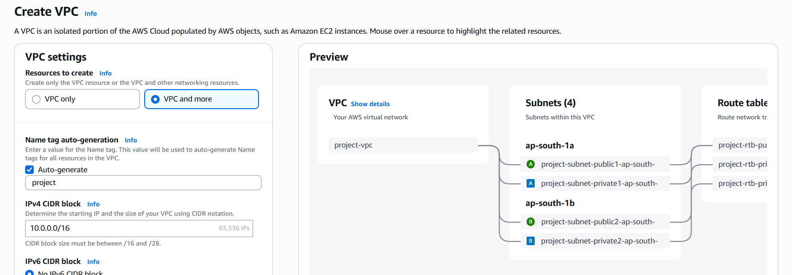
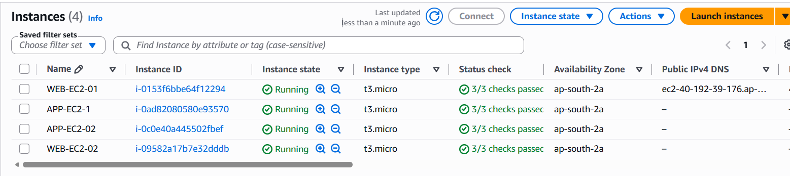
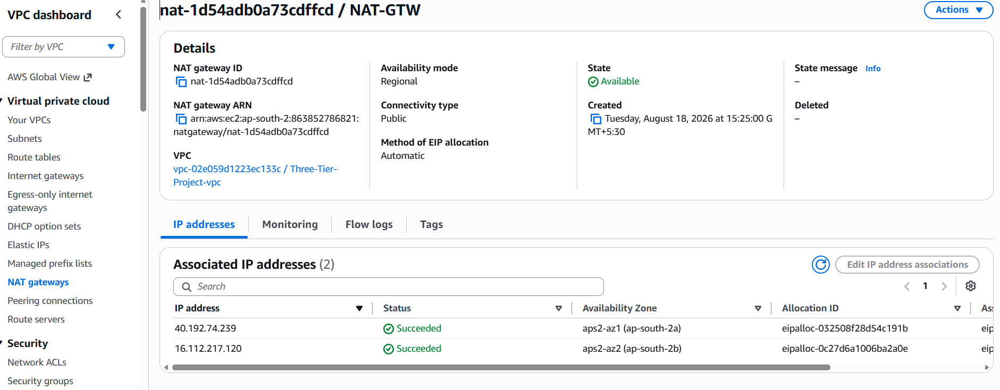
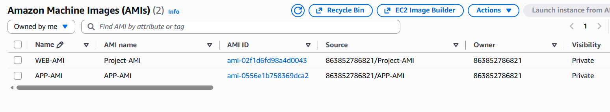
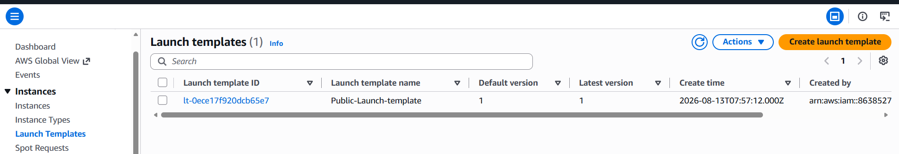
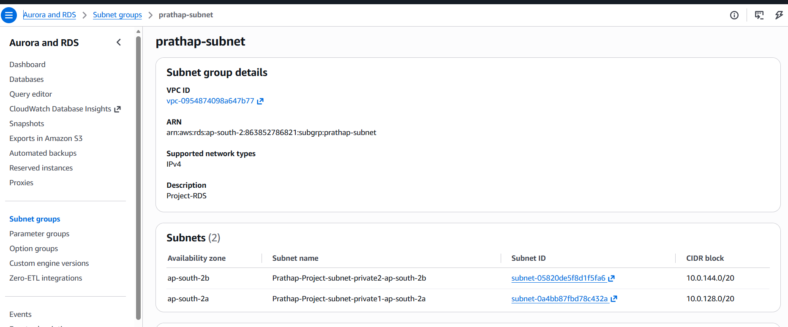
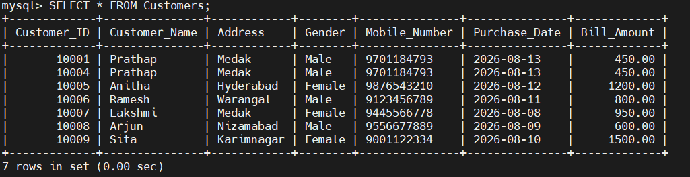

# AWS Multi‑Tier Scalable Architecture

---

## Project Description:
This project demonstrates the deployment of a highly available, secure, and scalable three‑tier web application architecture on AWS. 
It integrates load balancing, auto scaling, and multi‑AZ database redundancy to ensure resilience, while leveraging VPC networking and
security groups for controlled access across tiers.

---

## Architecture:


---

## Prerequisites:

* ✅ VPC
* ✅ Subnets
* ✅ Security groups configured
* ✅ NACL Default
* ✅ Four EC2 instances
* ✅ Auto scaling Groups
* ✅ Load Balancers-ALB
* ✅ AMI
* ✅ Launch Template
* ✅ NAT Gateway
* ✅ Internet Gateway
* ✅ RDS multi-Az
* ✅ SSH access to both instances
* ✅ Customer date to be inserted

---

### AWS:
AWS (Amazon Web Services) is the world’s most widely adopted cloud platform, offering over 200 fully featured services ranging from compute and storage to networking, databases, AI/ML, and security. It’s designed to help individuals, startups, and enterprises build scalable, reliable, and cost‑effective solutions.

---

### AWS Regions:
* AWS has Regions all around the world
* A region is a cluster of data centers

---

### AWS Availability Zones:
* Each region has many availability zones (usually 3, min is 3, max is 6).
* Each availability zone (AZ) is one or more discrete data centers with redundant power, 
networking, and connectivity
* They’re separate from each other, so that they’re isolated from disasters.

---

### VPC in AWS:
- **VPC (Virtual Private Cloud)**
  - You can have multiple VPCs in an AWS region  
    - Maximum: 5 per region (soft limit)
    - Maximum CIDR blocks per VPC: 5
  - CIDR block size limits:
    - Minimum: `/28` → 16 IP addresses
    - Maximum: `/16` → 65,536 IP addresses
- **Because VPC is private, only Private IPv4 ranges are allowed:**
  - `10.0.0.0 – 10.255.255.255` (`10.0.0.0/8`)
  - `172.16.0.0 – 172.31.255.255` (`172.16.0.0/12`)
  - `192.168.0.0 – 192.168.255.255` (`192.168.0.0/16`)

--- 

### Subnet: A subnet (short for subnetwork) is a logical subdivision of an IP network.
- **AWS reserves 5 IP addresses in every subnet (first 4 + last 1):**
  - These addresses are not available for use and cannot be assigned to EC2 instances.
  - **Example: CIDR block `10.0.0.0/24`**
    - `10.0.0.0` → Network Address
    - `10.0.0.1` → Reserved by AWS for the VPC router
    - `10.0.0.2` → Reserved by AWS for mapping to Amazon-provided DNS
    - `10.0.0.3` → Reserved by AWS for future use
    - `10.0.0.255` → Network Broadcast Address  
      - AWS does ***not support broadcast*** in a VPC, so this address is ***reserved***


---

## Types of subnets:
### Private subnet: 
A private Subnet does not have direct access to the internet.
A subnet where resources (like EC2 instances) are isolated from the public internet. 

### Public Subnet:
A subnet where resources can be accessed from the internet.
A Public Subnet in AWS is a subnet inside your VPC that is directly connected to the internet through an Internet Gateway.

---

## Internet Gateway (IGW)
- An Internet Gateway allows resources (e.g., EC2 instances) in a **VPC** to connect to the **Internet**.
- It scales **horizontally**, is **highly available**, and **redundant**.
- Must be created **separately** from a VPC.
- **One VPC ↔ One IGW** (a VPC can only be attached to one IGW, and an IGW can only be attached to one VPC).
---

## NAT Gateway (NATGW)
- AWS-managed **Network Address Translation (NAT)** service.
- Provides **higher bandwidth**, **high availability**, and **no administration** overhead.
- Billed **per hour** for usage and **per GB** of bandwidth.

---

### Key Points
- No **Security Groups** required or managed.
- Ideal for allowing **private EC2 instances** to access the Internet (e.g., software updates, package downloads).
- Ensures outbound connectivity while keeping instances **unreachable from the Internet**.

---

## Security Groups
- Security Groups are the **fundamentals of network security** in AWS.
- They control how traffic is allowed **into or out of EC2 instances**.
- Operate at the **instance level** (not subnet level like NACLs).

---

## Network Access Control List (NACL)

- NACLs act like a **firewall** controlling traffic **to and from subnets**.
- Each subnet is associated with **one NACL**.
- Newly created subnets are assigned the **Default NACL**.
- **Newly created NACLs** → deny all inbound/outbound traffic by default.
- **Default NACL** → allows all inbound/outbound traffic.
- NACLs are useful for **blocking specific IP addresses** at the subnet level.
- Stateless: return traffic must be explicitly allowed.
- Applied at the **subnet level**, not instance level.
- Complementary to **Security Groups** (which operate at the instance level).

---

### EC2: EC2 = Elastic Compute Cloud = Infrastructure as a Service

*virtual servers in the cloud
*renting computing power on demand
* We can choose the operating system, CPU, memory, storage, and networking configuration to suit your workload.

---

## Elastic Load Balancer (ELB)

- An **Elastic Load Balancer** is a **managed load balancer** provided by AWS.
- Load balancers are servers that **forward traffic** to multiple downstream servers (e.g., EC2 instances).
- ELB improves **availability, fault tolerance, and scalability** by distributing traffic intelligently.

### Types of Load Balancers

#### 1. Application Load Balancer (ALB)
- Operates at **Layer 7** (Application Layer).
- Protocols: **HTTP, HTTPS, WebSocket**.
- Best for: **Web applications, APIs, microservices**.
- Features: Content-based routing (URL, headers, cookies), supports modern protocols.

#### 2. Network Load Balancer (NLB)
- Operates at **Layer 4** (Transport Layer).
- Protocols: **TCP, TLS (secure TCP), UDP**.
- Best for: **High-performance, low-latency applications**.
- Features: Handles millions of requests per second, supports static IPs.

#### 3. Gateway Load Balancer (GWLB)
- Operates at **Layer 3** (Network Layer).
- Protocol: **IP**.
- Best for: Deploying **security appliances** (firewalls, intrusion detection/prevention).
- Features: Transparent traffic inspection, integrates with third-party appliances.

---

## Target Groups

- A **Target Group** is a logical grouping of targets:
  - **EC2 instances**
  - **IP addresses**
  - **Lambda functions**
- Load balancers (ALB, NLB, GWLB) forward traffic to one or more target groups.

### Health Checks
- Each target group has its own **health check configuration**.
- Only healthy targets receive traffic.
- Health checks can be customized (path, interval, timeout, success codes).

### Routing with ALB
- Application Load Balancers (ALB) support **rule-based routing**:
  - **Path-based routing** → e.g., `/app/*` → App target group.
  - **Host-based routing** → e.g., `api.example.com` → API target group.
- Enables **microservices architecture** and **service isolation**.

---

### Launch template:
*A Launch Template in AWS EC2 is a saved blueprint that contains all the settings needed to start an instance — 
like the AMI, instance type, key pair, security groups, and user data.

--- 

### AMI:
*An AMI (Amazon Machine Image) is a pre-configured template that contains the operating system, application server, and applications needed to launch an EC2 instance.

*Ready-made image used to create EC2 instances.

---

## Auto Scaling Group (ASG)

- Website and application load can change dynamically.
- In the cloud, servers can be created or terminated quickly.
- **Scale out** → Add EC2 instances to handle increased load.
- **Scale in** → Remove EC2 instances when load decreases.
- Maintain a **minimum** and **maximum** number of EC2 instances.
- Automatically **register new instances** with a Load Balancer.
- **Replace unhealthy instances** (re-create EC2 if terminated).
- ASG itself is **free**.
- You only pay for the **underlying EC2 instances** that are launched.

---

### Amazon RDS:
# Amazon RDS (Relational Database Service)
- RDS is a managed database service by AWS.
- It supports SQL as a query language.
- It allows you to create and manage cloud databases without manual administration.

## Supported Database Engines
- PostgreSQL
- MySQL
- MariaDB
- Oracle
- Microsoft SQL Server
- IBM DB2
- Aurora (AWS proprietary database)

## Amazon RDS Multi-AZ Deployment
- **Synchronous replication** between primary and standby
- **Single DNS name** – automatic application failover to standby
- **High availability** – minimizes downtime
- **Automatic failover** in case of:
  - Loss of Availability Zone (AZ)
  - Network failure
  - Instance failure
  - Storage failure
- **No manual intervention** required in applications

---

### Process Steps:

---

## Step-1: Create VPC and Subnets by using option called VPC and more


---

## Step-2: Launch an EC2 Instances in Public Subnet and Private Subnet 


* **EC2-1** → WEB-EC2-01 
* **EC2-1** → APP-EC2-01


---

## Step-3: Attach NAT Gateway to the two Private subnets


* ***NAT- GATEWAY*** → For both Private subnets - ***Regional***
 
---

## Step-4: Configure Security Groups for all resources
### AWS Security Group Rules

| RESOURCES  | Protocol   | Port Range     | Source                  |  Description                         |
|------------|------------|----------------|-------------------------|--------------------------------------|
| WEB-EC2    | HTTP & SSH | 80, 22         | ALB-SG & 0.0.0.0/0      | Allow web traffic + admin access     |
| APP-EC2    | TCP        | 22, 80, 3306   | WEB-SG, ALB-SG, RDS-SG  | Allow SSH, app traffic, DB access    |
| INTER-ALB  | TCP        | 22             | 0.0.0.0/0               | Allow admin access if required       |
| EXTER-ALB  | HTTP       | 80             | 0.0.0.0/0               | Public entry point for web traffic   |
| RDS-SG     | TCP        | 3306           | APP-SG                  | Allow MySQL/Aurora from App servers  |

---

## Step-5: SSH to EC2 Instances 
***Frontend*** 
```bash
ssh -i "C:\VCUBE DOCUMENTS\Hyderbadkeypair.pem" ubuntu@40.192.39.176
sudo -i
apt update -y
apt install apache2 -y
cd var/www/html
rm index.html
vim index.html (HTML Script)
systemctl restart apache2
```

***Backend***

```bash
vim demokeypair.pem
ssh -i "C:\VCUBE DOCUMENTS\demokeypair.pem" ubuntu@40.192.39.176
sudo -i
cd backend
apt update -y
apt install npm -y
apt install nodejs -y
node -v
npm -v
vim server.js
vim .env
npm init -y
npm install express mysql2 dotenv
node sever.js → Server is running on port 8080 / Connected to MYSQl
pkill node → Terminated nohup node server.js
netstat -tuln | grep 4000 → tcp 0 0.0.0:8080
curl local:8080/health → OK
```
---


## Step-6: Create AMI image and Launch template 


## Step-7: Launch New two instances in public and private subnets accordingly by using own AMI



## Step-8: Create Target Groups for both External and Internal Load balancers
                                       


| Target Group   | External TG         | Internal TG         |
| -------------- | ------------------- | ------------------- |
| Target Type    | Instances           | Instances           |
| Name           | TG-App              | TG-Web              |
| Protocol       | HTTP                | HTTP                |
| Port           | 80                  | 8080                |
| Path           | /                   | /api/*              |

| Health Check   | External TG         | Internal TG         |
| -------------- | ------------------- | ------------------- |
| Protocol       | HTTP                | HTTP                |
| Port           | 80                  | 80                  |
| Path           | /health             | /health             |


 


## Step-9: Create Application load balancer for both Web and App layers

| Setting        | External ALB        | Internal ALB        |
| -------------- | ------------------- | ------------------- |
| Name           | External-ALB-App    | Internal-ALB-App    |
| Type           | Application LB      | Application LB      |
| Scheme         | Internet-facing     | Internal            |
| VPC            | Project VPC         | Project VPC         |


## Step-10: Create RDS Data base for multi-AZ and EC2 End point Connection


## Step-10: Create Subnet for RDS and Configure the necessary connections 


## Step-11: Linux Commands used SSH from Web Tier to Application to Database

```bash
ssh -i "/c:/VCUBE DOCUMENTS/Custumkeypair.pem"@Ubuntu
sudo -i
vim Projectkeypair.pem
ssh -i "Projectkeypair.pem" ubuntu@
sudo -i
apt update -y
apt install mysql-server
systemctl start mysql.service
mysql -h end point -u admin -p
Password: Prathap123
````

### Step-11: Insert data into Database
```bash
Show dataabses;
create database prathap;
use prathap;

CREATE TABLE Customers (
    Customer_ID INT PRIMARY KEY,
    Customer_Name VARCHAR(255) NOT NULL,
    Address VARCHAR(255),
    Gender VARCHAR(10),
    Mobile_Number VARCHAR(15),
    Purchase_Date DATE,
    Bill_Amount DECIMAL(10,2)
    );

 Example:
INSERT INTO Customers
(Customer, Customer Name, Address, Gender, Mobile Number, Purchase Date, Bill Amount)
VALUES 
(10004, 'Prathap', 'Medak', 'Male', '9701184793', '2026-08-13', 450),
(10005, 'Anitha', 'Hyderabad', 'Female', '9876543210', '2026-08-12', 1200),
(10006, 'Ramesh', 'Warangal', 'Male', '9123456789', '2026-08-11', 800),
(10007, 'Lakshmi', 'Medak', 'Female', '9445566778', '2026-08-08', 950),
(10008, 'Arjun', 'Nizamabad', 'Male', '9556677889', '2026-08-09', 600),
(10009, 'Sita', 'Karimnagar', 'Female', '9001122334', '2026-08-10', 1500);

```


### Step-12: Verify Output 



               

